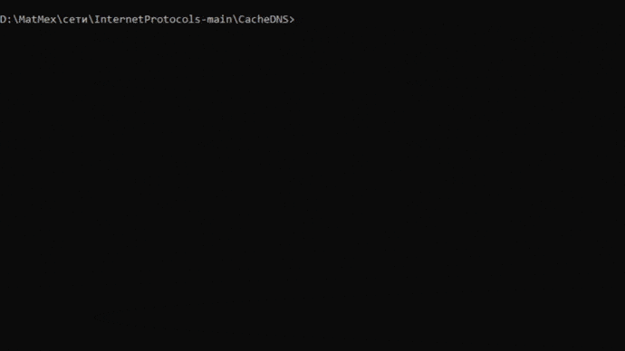

# Кэширующий DNS сервер

## Описание
Сервер прослушивает 53 порт. Сервер получает от клиента рекурсивный запрос и выполняет разрешение запроса. Полученная информация сохраняется в кэше сервера. Сервер регулярно просматривает  кэш и удаляет просроченные записи.

## Запуск
```commandline
python server.py 
```

## Пример работы
