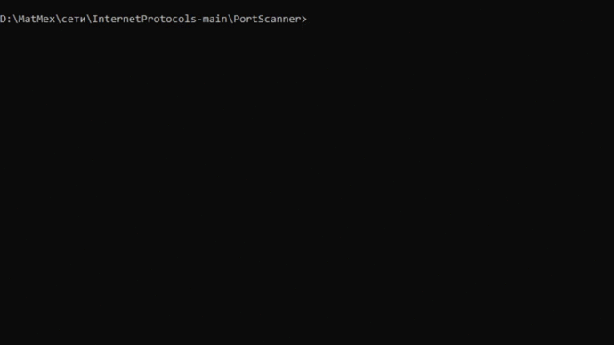

# Сканер TCP портов

## Описание
Сканер открытых TCP/UDP портов c определением некоторых протоколов [http, smtp, pop3, dns, sntp]

## Запуск
    python scanner.py -host 8.8.8.8 50..55
либо

    python scanner.py -host 8.8.8.8 53

## Пример работы
