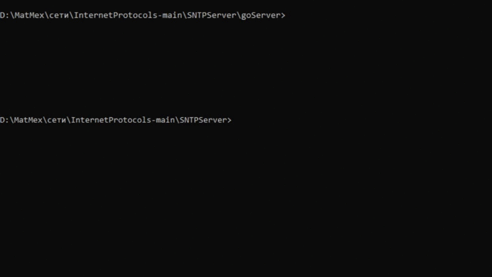

# SNTP сервер

## Описание
SNTP сервер точного времени, который «врет» на заданное в своём конфигурационном файле число секунд

## Запуск сервера
```commandline
python server.py -d 1000
```
либо
```commandline
go run . -d 1000
```
## Запуск клиента
```commandline
python client.py localhost
```

## Примеры работы

### Python


### Go


