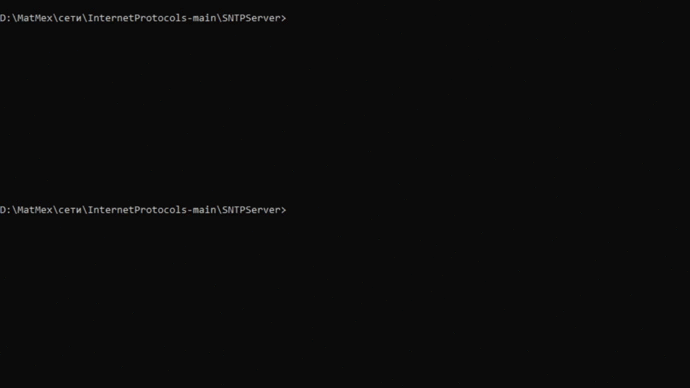

# SNTP сервер

## Описание
SNTP сервер точного времени, который «врет» на заданное в своём конфигурационном файле число секунд

## Запуск сервера
    python server.py -t 1000

## Запуск клиента
    python client.py localhost

