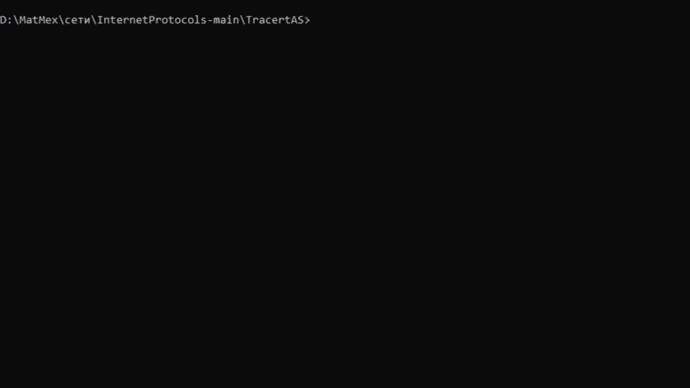

# Трассировка автономных систем

## Описание
Для каждого IP-адреса выводит номер автономной системы, к которой этот адрес относится, страну и провайдера

## Запуск
    python tracert_ac.py mit.edu
либо

    python tracert_ac.py 104.98.238.167

