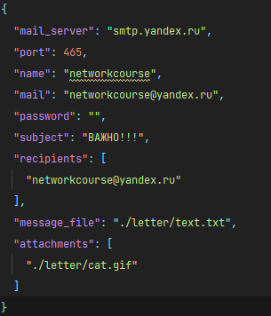
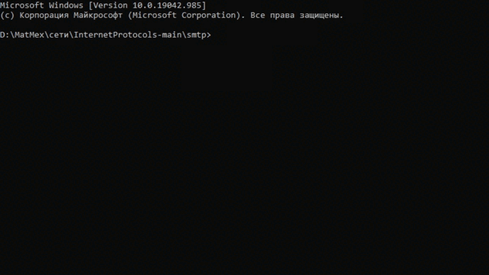

# SMTP клиент

## Описание
Реализация smtp клиента

## Конфигурация
- имя отправителя
- адрес отправителя
- пароль
- тема письма
- адреса получателей
- путь к файлам вложениям
- путь к файлу с сообщением

## Запуск
```commandline
python client.py
```

## Пример работы




